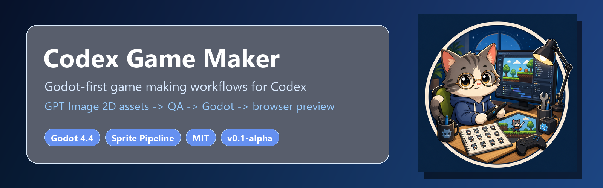

# Codex Game Maker

**Languages:** [English](README.md) | [简体中文](README.zh-CN.md)



**Codex skills for Godot-first game projects, game-ready 2D assets, and engine-ready prototypes.**

**Quick links:** [Install](#quick-start) · [Asset Pipeline](#gpt-image-2d-asset-pipeline) · [Engine Support](#engine-support) · [Skills](#whats-included) · [Professional Features](#professional-features) · [Safety Gates](#safety-and-gates) · [Prompts](#suggested-prompts) · [Roadmap](#roadmap)

[](LICENSE)


Turn a single Codex session into a Godot-first game making workspace.

Godot 4.4 workflows. GPT Image-ready 2D assets. Lightweight gates. Explicit professional modes.

> Status: `v0.1-alpha`. The core workflow is usable, but this is still an early preview. Use it as a template, inspect what it writes, and expect the showcase layer to evolve.

Codex Game Maker turns a Codex session into a practical game-making workspace: guided game design, engine detection, Godot 4.4 setup, sprite and map asset processing, Godot import helpers, lightweight production gates, and explicit professional workflows.

## Table Of Contents

- [What Makes It Different](#what-makes-it-different)
- [Showcase Plans](#showcase-plans)
- [What's Included](#whats-included)
- [Engine Support](#engine-support)
- [Quick Start](#quick-start)
- [GPT Image 2D Asset Pipeline](#gpt-image-2d-asset-pipeline)
- [What It Can Generate](#what-it-can-generate)
- [What You Get](#what-you-get)
- [Professional Features](#professional-features)
- [How It Works](#how-it-works)
- [Safety And Gates](#safety-and-gates)
- [Suggested Prompts](#suggested-prompts)
- [Repository Layout](#repository-layout)
- [Roadmap](#roadmap)

## What Makes It Different

Codex Game Maker is not just a prompt pack. It is a Codex-first game workflow where the agent plans the project, image generation creates raw assets, and deterministic local tools turn those assets into reusable game files.

| Pillar | What It Means |
|---|---|
| Godot-first projects | Blank folders default to Godot 4.4 + Web export, with installer/register/preview tools. |
| Game-ready 2D assets | Sprite sheets become transparent frames, GIF previews, metadata, QA reports, and Godot resources. |
| Lean studio structure | 8 core skills and review lenses instead of a huge default roster. |
| Explicit professional mode | Release, hooks, team passes, accessibility, localization, and audio workflows are opt-in. |
| Web-aware troubleshooting | Use web search for official docs when engine versions, APIs, export errors, or resource issues matter. |

## Showcase Plans

Generated showcase projects are treated as local output and are not committed to the repository by default. Planned before a polished public release:

- Cat platformer asset showcase with generated action bundle.
- Real Godot Web export evidence.
- 12-20 second demo GIF.
- Workflow diagram: prompt -> GPT Image -> processor -> QA -> Godot -> browser preview.

## What's Included

| Category | Count | Description |
|---|---:|---|
| Core skills | 8 | Start, design, art, sprite assets, map assets, asset QA, architecture, review. |
| Tool scripts | 29 | Install, register, export, preview, asset processing, gates, hooks, imports. |
| Guard scripts | 7 | Engine, asset, story, production, release, Godot lint, review gates. |
| Templates | 30 | GDDs, art briefs, asset specs, stories, production, release, QA, import manifests. |
| Asset processors/workflows | 2 | Pixel processing plus higher-level bundle/import/repair orchestration. |
| Professional aliases | 10 | `/release`, `/hotfix`, `/team-*`, `/audio-pass`, `/localization-pass`, and more. |

## Engine Support

| Engine / Stack | Support Level | What Works Now |
|---|---:|---|
| Godot 4.4 | First-class | Detection, installer/register tool, Web export, browser preview, GDScript lint, sprite import, map scene import. |
| Phaser / Three.js / PixiJS / HTML canvas | Basic/adoptable | Existing web projects are detected and respected; Codex can work in those stacks, but Godot remains the default for blank projects. |
| Unity | Detect/adopt only | Existing Unity projects are recognized and preserved; no Unity specialist pipeline yet. |
| Unreal | Detect/adopt only | Existing Unreal projects are recognized and preserved; no Unreal specialist pipeline yet. |

Blank folders default to Godot 4.4 + Web export. Existing projects keep their current engine unless the user asks to migrate.

## Quick Start

### Option 1: Use As A Game Template

```powershell
git clone https://github.com/0xnickmortal/Codex-Game-Maker.git my-game
cd my-game
powershell -ExecutionPolicy Bypass -File tools\check-install.ps1
```

macOS/Linux:

```bash
pwsh -File tools/check-install.ps1
```

Open Codex in the folder and ask:

```text
Use Codex Game Maker to start this game project.
```

For a blank folder, Codex Game Maker should summarize the idea, propose defaults, ask at most three important questions, and let the user say "go with defaults".

### Option 2: Install The Skills Globally

```powershell
powershell -ExecutionPolicy Bypass -File tools\install-codex-skills.ps1
```

macOS/Linux:

```bash
pwsh -File tools/install-codex-skills.ps1
```

Restart Codex after installing.

## Install Or Register Godot

Install Godot 4.4 and matching export templates:

```powershell
powershell -ExecutionPolicy Bypass -File tools\install-godot.ps1 -WithExportTemplates
```

macOS/Linux:

```bash
pwsh -File tools/install-godot.ps1 -WithExportTemplates
```

If Godot is already installed somewhere else, register it instead:

```powershell
powershell -ExecutionPolicy Bypass -File tools\register-godot.ps1 -GodotPath "F:\Godot_v4.4-stable_mono_win64\Godot_v4.4-stable_mono_win64"
```

Verify:

```powershell
powershell -ExecutionPolicy Bypass -File tools\check-godot.ps1
```

Preview a Godot project in browser:

```powershell
powershell -ExecutionPolicy Bypass -File tools\preview-godot-web.ps1 -Project . -CreatePresetIfMissing
```

## GPT Image 2D Asset Pipeline

Install local processing dependencies:

```powershell
python -m pip install -r requirements-asset-tools.txt
powershell -ExecutionPolicy Bypass -File tools\check-asset-tools.ps1
```

Pipeline:

```text
natural language request
  -> action bundle / map spec
  -> GPT Image raw sheet or map source
  -> chroma-key cleanup
  -> transparent PNG frames / prop slices
  -> GIF preview + pipeline-meta.json
  -> asset QA + deterministic repair
  -> Godot SpriteFrames / AnimatedSprite2D / editable level scene
  -> Godot Web preview
```

Plan a multi-action character bundle:

```powershell
powershell -ExecutionPolicy Bypass -File tools\create-action-bundle.ps1 -Root . -AssetId hero-cat -Description "cute orange tabby cat game hero with a blue backpack" -Actions "idle,run,jump,attack,hurt"
```

Save GPT Image raw sheets as:

```text
assets/raw/hero-cat-idle-sheet.png
assets/raw/hero-cat-run-sheet.png
assets/raw/hero-cat-jump-sheet.png
```

Process every available raw sheet:

```powershell
powershell -ExecutionPolicy Bypass -File tools\create-action-bundle.ps1 -Root . -AssetId hero-cat -Description "cute orange tabby cat game hero with a blue backpack" -Actions "idle,run,jump,attack,hurt" -ProcessExistingRaw
```

Run QA and deterministic repair:

```powershell
powershell -ExecutionPolicy Bypass -File tools\check-asset-qa.ps1 -Root .
powershell -ExecutionPolicy Bypass -File tools\repair-asset-processing.ps1 -Root . -Apply
```

Import accepted frames into Godot:

```powershell
powershell -ExecutionPolicy Bypass -File tools\import-sprite-to-godot.ps1 -Project . -BundleId hero-cat
```

For maps:

```powershell
powershell -ExecutionPolicy Bypass -File tools\process-prop-pack.ps1 -Input .\assets\raw\forest-props.png -OutDir .\assets\generated\props\forest -Rows 3 -Cols 3 -AssetId forest-props -ExpectedProps 9
powershell -ExecutionPolicy Bypass -File tools\compose-layered-map-preview.ps1 -Base .\assets\raw\map-base.png -Placements .\assets\raw\map-placements.json -Out .\assets\generated\maps\forest\preview.png
powershell -ExecutionPolicy Bypass -File tools\import-map-to-godot.ps1 -Project . -AssetId forest-level
```

## What It Can Generate

- Playable characters, enemies, NPCs, summons, monsters, and animated props.
- Action sheets: idle, walk, run, jump, attack, hurt, death, cast.
- Projectile, impact, muzzle flash, dust, spell, and hit FX.
- Reference-guided variants and identity-locked action sheets.
- Prop packs with extracted transparent props.
- Layered platformer, RPG, tower defense, and arena map assets.
- Collision, zones, exits, checkpoints, and placement metadata.
- Godot-ready `AnimatedSprite2D`, `SpriteFrames`, `Sprite2D`, `StaticBody2D`, `Area2D`, and `TileMapLayer` handoff files.

## What You Get

For a typical sprite action:

```text
raw-sheet-clean.png
sheet-transparent.png
frames/frame-000.png
frames/frame-001.png
animation.gif
pipeline-meta.json
asset-manifest.yaml entry
source prompt/provenance file
```

For a Godot sprite bundle:

```text
resources/animations/<bundle-id>_spriteframes.tres
scenes/characters/<bundle-id>.tscn
design/assets/godot-import-manifest.yaml
```

For a layered map:

```text
base image
dressed reference
prop pack or separated props
placement metadata
collision metadata
zones metadata
flattened preview
scenes/levels/<level-id>.tscn
```

## Professional Features

Professional workflows are explicit and opt-in.

| Alias | Status | Purpose |
|---|---:|---|
| `/release` | Available | Release checklist, changelog, patch notes, release gate. |
| `/hotfix` | Available | Small urgent fix flow with focused verification. |
| `/hooks-on` | Available | Install optional professional git hooks. |
| `/team-ui` | Planned | UI/UX, Godot Control implementation, art consistency, QA review. |
| `/team-level` | Planned | Level design, implementation, art readability, playtest evidence. |
| `/team-combat` | Planned | Combat rules, feedback, tuning, and QA. |
| `/audio-pass` | Planned | Music/SFX plan and trigger points. |
| `/narrative-pass` | Planned | Story, dialogue, worldbuilding, narrative delivery. |
| `/localization-pass` | Planned | Text surfaces, fonts, string length, localization readiness. |
| `/accessibility-pass` | Planned | Input, readability, subtitles, assists, motion comfort. |

Aliases live in:

```text
codex-game-studio/references/commands/catalog.yaml
```

Optional hooks:

```powershell
powershell -ExecutionPolicy Bypass -File tools\install-professional-hooks.ps1
powershell -ExecutionPolicy Bypass -File tools\uninstall-professional-hooks.ps1
```

## How It Works

1. Codex detects the current project stage and engine.
2. The kickoff skill summarizes the request and asks only the highest-value questions.
3. Design and art skills create lightweight docs before broad implementation.
4. Asset skills plan and process generated runtime assets.
5. Architecture and story gates keep implementation small and reviewable.
6. QA/review gates check evidence before demos, exports, and handoff.
7. Professional workflows can be explicitly activated for larger projects.

This is not an autopilot system. The user stays in control; Codex Game Maker provides structure, defaults, tools, and review gates.

## Safety And Gates

| Gate | Tool | What It Checks |
|---|---|---|
| Install | `tools/check-install.ps1` | Skills, scripts, templates, Godot availability, setup health. |
| Asset tools | `tools/check-asset-tools.ps1` | Python, Pillow, numpy, processor/workflow scripts. |
| Asset QA | `tools/check-asset-qa.ps1` | Alpha, frame count, GIF, metadata, chroma-key residue, map metadata. |
| Story | `tools/check-story-gate.ps1` | Acceptance criteria, files to touch, verification plan, done evidence. |
| Production | `tools/check-production-gate.ps1` | Lightweight epic/sprint/story structure. |
| Godot lint | `tools/check-godot-lint.ps1` | Missing `res://`, unused `delta`, tuning hardcodes, UI/gameplay coupling. |
| Review | `tools/check-review-gate.ps1` | Smoke evidence, playtest evidence, project structure, export readiness. |
| Release | `tools/check-release-gate.ps1` | Professional release readiness. |

## Suggested Prompts

Start a new project:

```text
Use Codex Game Maker to start a small cozy platformer. Guide me step by step and go with defaults if I do not know.
```

Create a sprite bundle:

```text
Use Codex Game Maker to create a cute cat platformer hero with idle, run, jump, attack, and hurt animations.
```

Create a map:

```text
Use Codex Game Maker to create a Godot-editable forest shrine map with separated props, collision blockers, exit zones, and a debug player scene.
```

Review before a demo:

```text
Use Codex Game Maker to review this project before I export a browser demo.
```

Professional release mode:

```text
/release Prepare this Godot Web demo for a public alpha release.
```

## Repository Layout

```text
codex-game-studio/
  .codex-plugin/
  skills/
  references/
  scripts/
tools/
docs/
assets/
  brand/
production/
requirements-asset-tools.txt
README.md
README.zh-CN.md
LICENSE
```

## Roadmap

Near-term:

- Real asset-driven cat platformer showcase.
- Demo GIF and workflow diagram.
- macOS/Linux smoke tests.
- Godot CLI validation that generated `.tres` and `.tscn` load cleanly.
- Better reference-guided identity consistency review.

Later:

- True GPT Image job orchestration, retry, and cost tracking.
- Deeper Phaser/Three.js/PixiJS examples.
- Optional Unity/Unreal specialist workflows if users actually need them.
- Marketplace packaging once Codex plugin distribution is stable.

## More Docs

- [Chinese README](README.zh-CN.md)
- [Changelog](CHANGELOG.md)
- [Contributing](CONTRIBUTING.md)
- [Open source installation](docs/OPEN_SOURCE_INSTALLATION.md)
- [Project migration](docs/PROJECT_MIGRATION.md)
- [Asset pipeline completion plan](docs/ASSET_PIPELINE_COMPLETION_PLAN.md)
- [Release assets checklist](docs/RELEASE_ASSETS.md)
- [Current gaps vs Claude Code Game Studios](docs/CURRENT_GAPS_VS_CLAUDE_GAME_STUDIOS.md)

## License

MIT. See [LICENSE](LICENSE).

