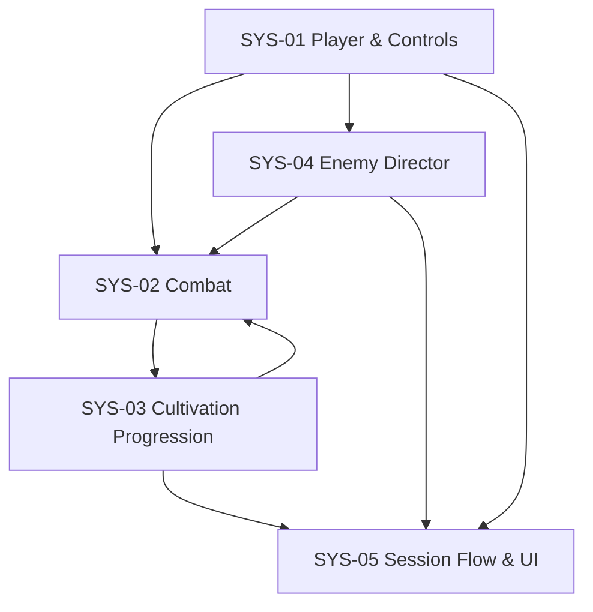

# Systems Index: Vân Mộng Tu Tiên

Status: Implemented and covered by native automated journeys; Web/manual verification pending  
Source concept: `design/gdd/game-concept.md`  
Scope: one 4-minute MVP session

## MVP Systems

| ID | System | Document | MVP responsibility | Upstream | Downstream |
|---|---|---|---|---|---|
| SYS-01 | Player & Controls | `design/gdd/system-player-controls.md` | 8-direction movement, HP, contact immunity, arena bounds, input contexts | Input Map, tuning | combat, enemies, session, HUD |
| SYS-02 | Combat | `design/gdd/system-combat.md` | auto qi sword, active Sword Ring, damage/cooldowns, upgrade effects | player, enemies, progression | enemy death, feedback, HUD |
| SYS-03 | Cultivation Progression | `design/gdd/system-cultivation-progression.md` | XP orbs, level thresholds, three-card choice, realms | enemy death, session state | player/combat modifiers, HUD, session pause |
| SYS-04 | Enemy Director | `design/gdd/system-enemy-director.md` | escalating spawns, ordinary/elite beasts, boss at 2:30 | session clock, arena bounds | combat targets, XP, victory/death pressure |
| SYS-05 | Session Flow & UI | `design/gdd/system-session-flow-ui.md` | title, timers, pause, breakthrough modal, win/loss, restart, HUD | all gameplay signals | global process state, presentation |

## Dependency Order

Recommended implementation slices:

1. Session shell + player movement + procedural arena.
2. One enemy + auto sword + health/death.
3. XP orb + one deterministic three-card choice.
4. Spawn curve + fast enemy + full upgrade pool + realm transitions.
5. Boss, victory/defeat, pause/restart, presentation/audio polish.
6. Godot parse/lint, 4-minute playtest, Web export and browser input smoke test.

## Shared Tuning Baseline

These are first-playtest values, not final balance. One config Resource should own them.

| Domain | Baseline |
|---|---|
| Session | 240 s; boss at 150 s; event beats at 75 s and 115 s |
| Player | 120 HP; 305 px/s; 0.55 s contact immunity |
| Auto sword | 22 damage; 0.72 s interval; 690 px/s projectile |
| Sword Ring (`qi_pulse`) | 48 damage; 190 px radius; 5.5 s cooldown |
| Level XP | `first_level × growth^(level - 1)`; baseline 18 × 1.28^(level−1) |
| Realms | Phàm Nhân 1; Luyện Khí 3; Trúc Cơ 6; Kim Đan 10; Nguyên Anh 14 |
| Arena | logical 1600x900; player margin 54 px; window override 1280x720 |
| Entity budget | max 125 living enemies; projectiles/orbs capped by profiling |

## Shared Signals / Events

Names may follow code style, but payload ownership must remain stable.

| Event | Payload | Producer | Consumers |
|---|---|---|---|
| `Events.player_health_changed` | current, maximum | player | HUD |
| `CultivatorPlayer.died` | none | player | main/session |
| `CultivationEnemy.died` | enemy, position, xp_value, was_boss | enemy | main/orb factory/session |
| `Events.experience_changed` | current, required, level | main progression | HUD |
| `Events.upgrade_options_presented` | three option dictionaries | main progression | choice overlay |
| `Events.upgrade_selected` | stable upgrade id | choice overlay | main progression/combat/player |
| `Events.realm_changed` | realm name, subtitle | main progression | HUD, feedback |
| `Events.pulse_state_changed` | remaining, cooldown | combat | HUD |
| `Events.run_stats_changed` | elapsed, duration, kills | main/session | HUD |
| `Events.game_paused` | is_paused | main/session | pause overlay |
| `Events.game_finished` | victory, title, details | main/session | end overlay |

## MVP Cut Line

Included: one arena, one hero, ordinary/elite enemy profiles, one boss, one auto attack, one active skill, the current upgrade pool, five realm milestones, core HUD and end states.

Deferred: save/meta, equipment, inventory, quests/dialogue, extra maps/characters, touch/gamepad, localization system beyond Vietnamese strings, online services, shader-heavy VFX, procedural music and external asset packs.

## Cross-System Invariants

- Only `PLAYING` advances gameplay time and damage.
- Breakthrough offers exactly three distinct valid choices and freezes combat until one is accepted.
- Boss spawn is once-only and cannot be suppressed by the active-enemy cap.
- A session ends once; victory/defeat transitions are idempotent.
- `R` constructs fresh mutable state; no prior cooldown, enemy, orb, XP or choice leaks into the new run.
- UI never mutates health/XP/enemy state directly; it emits a request carrying a stable ID.
- Visible Vietnamese control text must match explicit bindings in `project.godot`.

## Definition Of MVP Ready

- [ ] All five systems meet their acceptance criteria in native Godot.
- [ ] One uninterrupted full run reaches a valid end by 4:00.
- [ ] Pause, breakthrough and restart state transitions have no clock/damage leakage.
- [ ] Boss appears at 2:30 and both win routes work.
- [ ] Browser build verifies canvas focus, every advertised key and card selection.
- [ ] Performance remains readable and responsive at peak spawn pressure.

Documentation is ready for implementation. Runtime checks remain pending because Godot CLI/export templates were not available during design.

## PLAYER_READY Expansion Systems — 2026-07-30

The following systems extend, rather than invalidate, SYS-01 through SYS-05:

| ID | System | Document | Responsibility | Upstream | Downstream |
|---|---|---|---|---|---|
| SYS-06 | Run Skills & Evolution | `design/gdd/system-run-skills.md` | five-slot loadout, level 1–20, valid three-choice offers, five-rank behavior/VFX milestones | combat, progression, input | HUD, VFX, audio, build summary |
| SYS-07 | Loot, Items & Equipment | `design/gdd/system-items-equipment.md` | definitions/instances, affixes, drops, compare/equip/salvage, combat modifiers | enemy/encounter result | meta profile, loadout, tooltips |
| SYS-08 | Spirit Beast | `design/gdd/system-spirit-beast.md` | one equipped companion, assist, bond, targeting, growth/evolution and cleanup | meta loadout, combat state | skills, HUD, VFX/audio |
| SYS-09 | Expanded Economy | `design/gdd/system-expanded-economy.md` | separate in-run, run-reward and persistent economies with sources/sinks | results, loot, achievements | techniques, equipment, beasts |

Dependency order: SYS-06 first; SYS-07/SYS-08 depend on stable tag/modifier contracts; SYS-09 binds all three to save migration and result flow. Every new system adds its player-visible states to the schema-v2 state graph only after its runtime path and recovery behavior exist.
