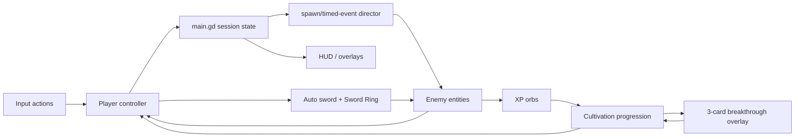

# Architecture: Vân Mộng Tu Tiên

Status: Verified  
Release evidence boundary: native runtime is verified; Web export and target-platform verification remain pending  
Engine: Godot 4.4, GDScript, Compatibility renderer, Web export  
Target: desktop browsers, logical 1600x900 rendered in a 1280x720 window override, 60 FPS

## Engine Detection

Detected engine: Godot 4.4 project.  
Evidence: `project.godot` is present with `config/features=PackedStringArray("4.4", "GL Compatibility")`, `run/main_scene="res://scenes/main.tscn"`, and explicit project input actions; source GDScript/resources are under `scripts/` and `resources/`.  
Recommendation: continue the Godot project and export with the Compatibility renderer using the default single-threaded Web path.

Environment note (2026-07-29): an official Godot 4.6.2 binary and pinned Web export templates are installed in the Codex cache. Native import/parse, scene boot, deterministic smoke, native captures, Web export and served Chromium smoke pass. Firefox/Safari, physical-device and human audio/browser review remain **not verified**.

## Architecture Goals

- Deliver a deterministic four-minute arena whose state always reaches victory or defeat.
- Keep simulation/session state separate from visual drawing, HUD and input plumbing.
- Keep scene boundaries small enough to tune player, attacks, enemies, XP and UI independently.
- Make all advertised keyboard controls explicit project actions and test browser canvas focus.
- Use procedural ink-wash runtime visuals so a missing key-art asset never blocks gameplay.
- Favor Web-compatible GDScript and simple 2D nodes; no native extension, C#, runtime network or multithread requirement.

## Runtime Model

Use a single scene tree. `scripts/gameplay/main.gd` is the source of truth for session time/state, spawn progression, combat orchestration and cultivation progression in this compact MVP; gameplay entities own local health/motion, while `scripts/ui/hud.gd` only displays state and emits requests through `Events`. Rendering nodes read entity state but do not decide damage, XP thresholds or win conditions.



## Target Godot Project Structure

```text
project.godot
export_presets.cfg                 # once Web export is configured
scenes/
  main.tscn                        # small composition root and arena
scripts/
  core/events.gd                   # small signal hub/autoload
  core/game_config.gd              # JSON loading
  core/input_bootstrap.gd          # canonical Input Map fallback
  gameplay/main.gd                 # state/time/spawn/combat/progression orchestration
  gameplay/player.gd
  gameplay/enemy.gd
  gameplay/projectile.gd
  gameplay/qi_orb.gd
  gameplay/game_effect.gd
  gameplay/ink_background.gd
  ui/hud.gd
resources/
  tuning/game_balance.json          # authoritative MVP tuning
assets/
  generated/                        # accepted generated art only
  source-prompts/                   # generation provenance
design/assets/asset-manifest.yaml
```

For the MVP, closely related nodes may share one scene/script when that keeps delivery smaller, but ownership in the table below must remain explicit. Do not introduce an autoload solely to avoid passing one reference.

## System Boundaries

| System | Godot representation | Owns | Emits | Depends on |
|---|---|---|---|---|
| Session flow | main Node/state enum | elapsed time, START/RUNNING/LEVEL_UP/PAUSED/VICTORY/DEFEAT, restart | `run_stats_changed`, `game_paused`, `game_finished` | progression, boss status, player death |
| Player control | `CharacterBody2D` | velocity, current HP, contact invulnerability | `Events.player_health_changed`, local `died` | Input Map, tuning |
| Combat | main orchestration + dynamic projectile Nodes | cooldowns, target selection, hit payload | `Events.pulse_state_changed`, enemy death facts | player position, enemy collection, tuning |
| Enemy director | main spawn accumulator/timed events | spawn cadence, event flags, boss-once flag | `Events.banner_requested`, local spawn/death facts | session time, arena bounds, tuning |
| Enemy | `CharacterBody2D` dynamic instances | HP, move speed, contact damage, XP value | `died`, `player_contact`, `boss_slam` | player position, tuning |
| XP/cultivation | main progression state + dynamic orb Nodes | XP, level, realm, upgrade ranks | `experience_changed`, `upgrade_options_presented`, `realm_changed` | enemy death, choice result, tuning |
| HUD/overlays | CanvasLayer Controls built by `hud.gd` | presentation only, focus selection | `start_requested`, `restart_requested`, `upgrade_selected` | session/progression signals |
| Ink presentation | Node2D `_draw()` / reusable draw helpers | cached procedural geometry/seed | none required | entity presentation data, art bible |
| Audio | AudioStreamPlayer pool | playback only | none required | gameplay/session events |

## State Machine

```text
START --confirm/Enter/button--> RUNNING
RUNNING --level threshold--> LEVEL_UP --choose card--> RUNNING
RUNNING --P--> PAUSED --P--> RUNNING
RUNNING --HP <= 0--> DEFEAT
RUNNING --boss defeated OR elapsed >= 240s--> VICTORY
VICTORY/DEFEAT/RUNNING/LEVEL_UP/PAUSED --R--> reload fresh START session
```

Only `RUNNING` advances the session clock, enemy spawns, movement, attack timers and damage. `LEVEL_UP` freezes combat but allows the card UI. `PAUSED` freezes combat and only listens for pause/restart UI actions. Resolve boss defeat before death/timeout in the same tick; all result paths lead to one idempotent terminal transition.

## Data And Tuning

Gameplay values belong in `resources/tuning/game_balance.json` during the MVP. Scripts may provide defensive defaults, but they must match this authoritative source and all values listed in the system GDDs.

Minimum tuning domains:

- arena margin, player speed/HP/contact immunity;
- auto-sword interval/range/damage and Sword Ring damage/radius/cooldown;
- enemy stats, spawn curve, max active enemies and boss stats/time;
- XP thresholds, pickup/magnet radius, level-to-realm thresholds;
- upgrade card increments and stack caps.

Do not serialize Nodes or visual objects as gameplay data.

## Asset Pipeline

Generated assets: `KEYART-001` is accepted with warning and versioned under `assets/generated/key-art/`; MVP gameplay visuals are procedural.  
Prompt provenance: `assets/source-prompts/`, cross-referenced by `design/assets/asset-manifest.yaml`.  
Import settings: key art uses linear filtering and aspect-cover in a `TextureRect`; avoid importing raw source at an unnecessarily large runtime size.  
Web export: target processed splash ≤ 1.5 MB; no remote texture dependency, no temp-folder references, and no asset required to start combat.

## Save/Load

Format: none for MVP gameplay; restarting creates a new in-memory session.  
Location/versioning: deferred. If settings are later added, use a versioned dictionary in `user://settings.cfg` or JSON and handle non-persistent Web storage.  
Web risk: browser `user://` persistence depends on IndexedDB/cookie context; not relevant to MVP completion.

## Input

Keyboard: project actions `move_left`, `move_right`, `move_up`, `move_down`, `qi_pulse`, `pause_game`, `restart_game`, `confirm`.  
Bindings: WASD + arrows; `Space`; `P`; `R`.  
Gamepad/remapping/touch: deferred; UI must not advertise them.  
Web: first interaction/title affordance establishes canvas focus; suppress key echo for toggles; browser-run verification is required.

## Audio

Audio is event-driven presentation. Short imported WAV cues may use `AudioStreamWAV`/`AudioStreamPlayer`; music and procedural audio are optional and must not block MVP. Browser autoplay restrictions mean no promise of sound before the first user gesture. Keep the game readable with audio muted.

## Performance Budget

| Budget | Target |
|---|---|
| Resolution | 1600x900 logical viewport; window override 1280x720, stretch while preserving 16:9 |
| Frame rate | 60 FPS target; gameplay must remain correct at lower render FPS |
| Physics | 60 Hz; no frame-dependent timers |
| Active enemies | configured maximum 125 living enemies, including scripted pressure |
| Active projectiles/orbs | pool or cap; target ≤ 160 combined |
| Particles | short-lived; target ≤ 400 visible particles |
| Generated textures | one processed key art, ≤ 2048 px long edge and ≤ 1.5 MB target |
| Threads | none required; default single-thread Web export |

## Technical Risks

| Risk | Severity | Verification plan | Source |
|---|---|---|---|
| Web export requires WebGL 2.0/Compatibility and served files | Medium | Export `index.html`, serve locally, run on Chromium and Firefox | Godot Web export docs |
| Keyboard focus/captured keys in browser | High | Click canvas/title, verify every advertised binding, pause/restart and no key echo double-toggle | `InputEventKey` + Web docs |
| Browser/platform matrix | High | Run Chromium smoke (done), then Firefox/Safari and physical-device input/audio checks | local environment + Web evidence |
| Spawn/particle overdraw | Medium | 4-minute stress run with enemy cap; inspect frame time near 2:30 boss beat | project performance budget |
| Audio blocked until user gesture | Low | Test muted first load and first input unlock; gameplay remains clear without sound | Web export docs |
| Pause/choice state conflict | High | deterministic state-transition tests; confirm timer and damage frozen in both overlays | control manifest |
| Accepted key art missing at runtime path | Low | start and complete combat with procedural fallback | asset manifest |

## Required ADRs

- [x] ADR-0001: Godot 4.4 + Compatibility, GDScript and single-threaded Web export.
- [ ] ADR-0002: Persistence format, only if settings/meta-progression enter scope.
- [ ] ADR-0003: Asset loading/preload policy, only if runtime asset count grows beyond splash.

## Official Godot 4.4 References

- Web export: https://docs.godotengine.org/en/4.4/tutorials/export/exporting_for_web.html
- `CharacterBody2D`: https://docs.godotengine.org/en/4.4/classes/class_characterbody2d.html
- `InputEventKey`: https://docs.godotengine.org/en/4.4/classes/class_inputeventkey.html
- `AudioStreamWAV`: https://docs.godotengine.org/en/4.4/classes/class_audiostreamwav.html

Checked 2026-07-29. The docs confirm that Web targets the Compatibility renderer/WebGL 2.0, single-threaded export is the preferred default, `CharacterBody2D.MOTION_MODE_FLOATING` is suited to top-down movement, keyboard event mappings should set one key representation and not rely on OS key-repeat cadence, and `AudioStreamWAV` stores WAV sample data for playback. These are documentation decisions only; local export/runtime remains unverified.

## Implementation Gate

Architecture is verified for the native candidate and Godot 4.6.2 Web/Chromium smoke. Completion still requires a full four-minute playtest, supported-browser matrix, physical mobile QA, human listening and release/compliance evidence. Do not equate the current Web smoke with commercial release readiness.
